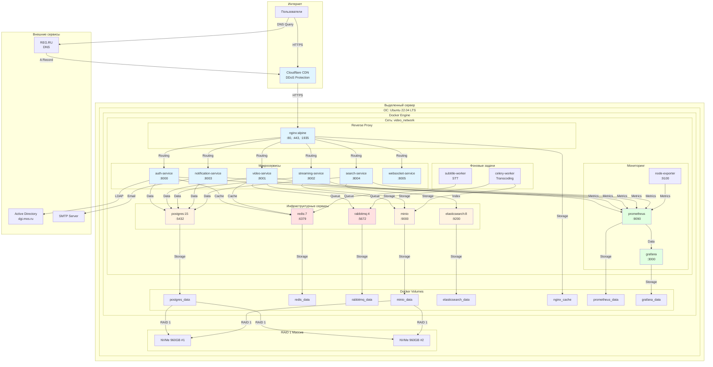
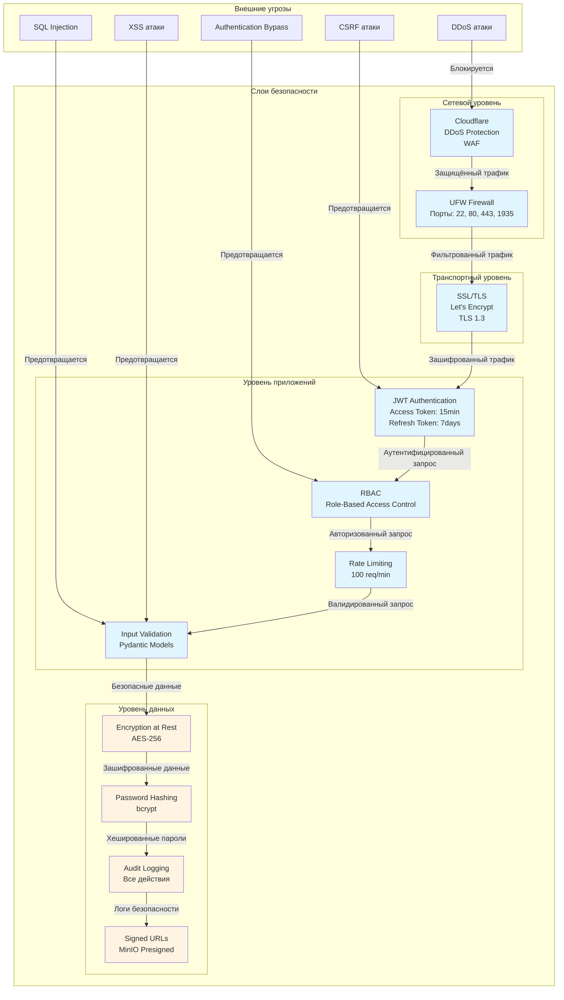
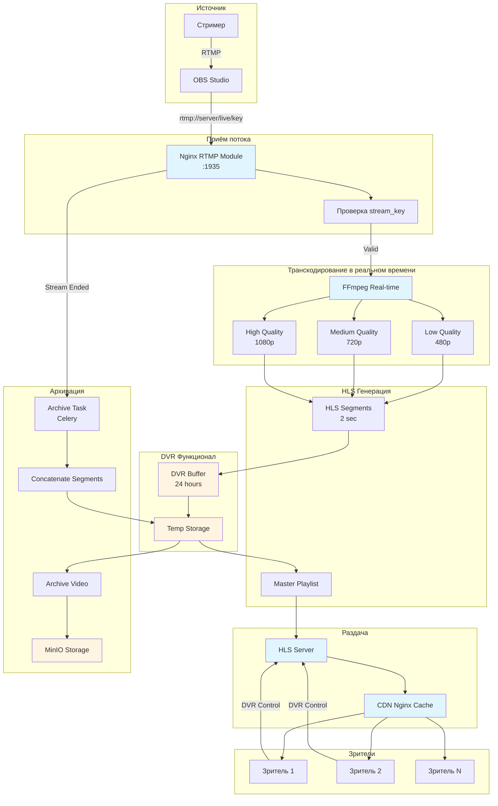
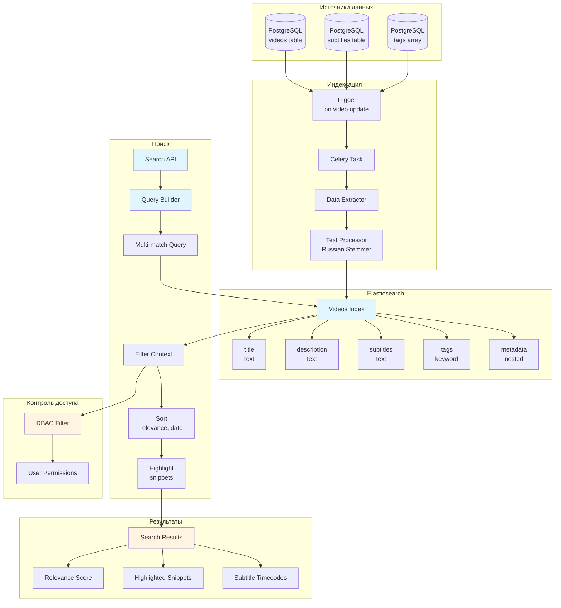
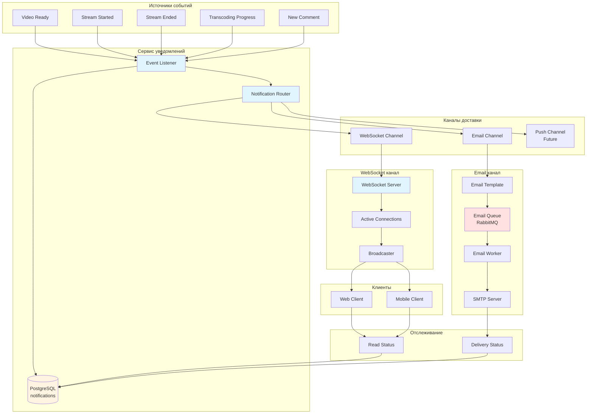
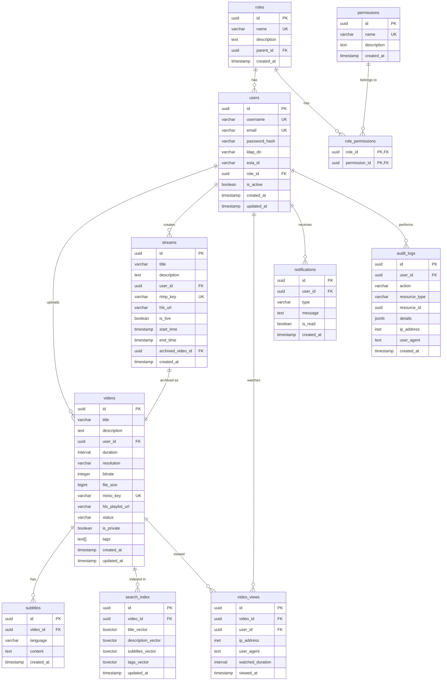
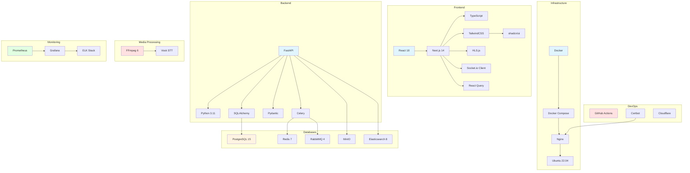

# Архитектурные диаграммы для дипломной работы

## Диаграмма 1: Общая архитектура микросервисной системы

```mermaid
graph TB
    subgraph "Клиентский уровень"
        Web[Web Browser]
        Mobile[Mobile App]
    end
    
    subgraph "Уровень доступа"
        Nginx[Nginx Reverse Proxy<br/>SSL/TLS Termination<br/>Load Balancing]
    end
    
    subgraph "Уровень микросервисов"
        Auth[Auth Service<br/>:8000<br/>FastAPI]
        Video[Video Service<br/>:8001<br/>FastAPI]
        Streaming[Streaming Service<br/>:8002<br/>FastAPI]
        Notification[Notification Service<br/>:8003<br/>FastAPI]
        Search[Search Service<br/>:8004<br/>FastAPI]
        WebSocket[WebSocket Service<br/>:8005<br/>Socket.io]
    end
    
    subgraph "Уровень обработки"
        Celery[Celery Workers<br/>FFmpeg Transcoding]
        Subtitle[Subtitle Workers<br/>Vosk STT]
    end
    
    subgraph "Уровень очередей"
        RabbitMQ[RabbitMQ<br/>Message Broker]
        Redis[Redis<br/>Cache & Queue]
    end
    
    subgraph "Уровень хранения данных"
        PostgreSQL[(PostgreSQL<br/>Relational DB)]
        MinIO[MinIO<br/>Object Storage]
        Elasticsearch[Elasticsearch<br/>Search Engine]
    end
    
    subgraph "Уровень мониторинга"
        Prometheus[Prometheus<br/>Metrics Collection]
        Grafana[Grafana<br/>Visualization]
        AlertManager[AlertManager<br/>Alerting]
    end
    
    subgraph "Внешние системы"
        AD[Active Directory<br/>LDAP]
        ESIA[ЕСИА<br/>OAuth 2.0]
        SMTP[SMTP Server<br/>Email]
    end
    
    Web -->|HTTPS| Nginx
    Mobile -->|HTTPS| Nginx
    
    Nginx -->|/api/auth| Auth
    Nginx -->|/api/video| Video
    Nginx -->|/api/streaming| Streaming
    Nginx -->|/api/notifications| Notification
    Nginx -->|/api/search| Search
    Nginx -->|/ws| WebSocket
    
    Auth -->|JDBC| PostgreSQL
    Video -->|JDBC| PostgreSQL
    Streaming -->|JDBC| PostgreSQL
    Notification -->|JDBC| PostgreSQL
    Search -->|JDBC| PostgreSQL
    
    Video -->|S3 API| MinIO
    Streaming -->|S3 API| MinIO
    Celery -->|S3 API| MinIO
    
    Search -->|HTTP| Elasticsearch
    
    Video -->|AMQP| RabbitMQ
    Streaming -->|AMQP| RabbitMQ
    Notification -->|AMQP| RabbitMQ
    
    Celery -->|AMQP| RabbitMQ
    Subtitle -->|Redis| Redis
    
    Auth -->|Redis| Redis
    Video -->|Redis| Redis
    Streaming -->|Redis| Redis
    
    Auth -->|LDAP| AD
    Auth -->|OAuth 2.0| ESIA
    Notification -->|SMTP| SMTP
    
    Auth -->|Metrics| Prometheus
    Video -->|Metrics| Prometheus
    Streaming -->|Metrics| Prometheus
    Notification -->|Metrics| Prometheus
    Search -->|Metrics| Prometheus
    
    Prometheus -->|Alerts| AlertManager
    Prometheus -->|Data| Grafana
    
    style Nginx fill:#e1f5ff
    style Auth fill:#e1f5ff
    style Video fill:#e1f5ff
    style Streaming fill:#e1f5ff
    style Notification fill:#e1f5ff
    style Search fill:#e1f5ff
    style WebSocket fill:#e1f5ff
    style PostgreSQL fill:#fff4e1
    style MinIO fill:#fff4e1
    style Elasticsearch fill:#fff4e1
    style RabbitMQ fill:#ffe1e1
    style Redis fill:#ffe1e1
    style Prometheus fill:#e1ffe1
    style Grafana fill:#e1ffe1
```

## Диаграмма 2: Схема развертывания инфраструктуры

## Диаграмма 3: Архитектура безопасности

## Диаграмма 4: CI/CD Pipeline

```mermaid
graph LR
    subgraph "Разработка"
        Dev[Разработчик]
        Git[GitHub Repository]
    end
    
    subgraph "Continuous Integration"
        Push[Push to develop]
        Trigger[GitHub Actions Trigger]
        Lint[Linting<br/>flake8, black]
        TypeCheck[Type Checking<br/>mypy]
        UnitTests[Unit Tests<br/>pytest<br/>Coverage > 80%]
        IntegrationTests[Integration Tests<br/>Testcontainers]
        LoadTests[Load Tests<br/>Locust]
        SecurityScan[Security Scan<br/>Bandit]
    end
    
    subgraph "Build"
        DockerBuild[Build Docker Images]
        DockerPush[Push to Registry]
    end
    
    subgraph "Continuous Deployment"
        DeployStaging[Deploy to Staging<br/>docker-compose]
        SmokeTests[Smoke Tests]
        ManualApproval[Manual Approval<br/>Create Release]
        DeployProd[Deploy to Production<br/>docker-compose]
        HealthCheck[Health Check]
        Rollback[Rollback if Failed]
    end
    
    subgraph "Monitoring"
        Alerts[Alerts<br/>Telegram]
        Logs[Logs<br/>ELK Stack]
    end
    
    Dev -->|Commit| Git
    Git -->|Push| Push
    Push -->|Trigger| Trigger
    
    Trigger --> Lint
    Lint --> TypeCheck
    TypeCheck --> UnitTests
    UnitTests --> IntegrationTests
    IntegrationTests --> LoadTests
    LoadTests --> SecurityScan
    
    SecurityScan -->|Success| DockerBuild
    SecurityScan -->|Failure| NotifyDev[Notify Developer]
    
    DockerBuild --> DockerPush
    DockerPush --> DeployStaging
    
    DeployStaging --> SmokeTests
    SmokeTests -->|Success| ManualApproval
    SmokeTests -->|Failure| Rollback
    
    ManualApproval --> DeployProd
    DeployProd --> HealthCheck
    
    HealthCheck -->|Success| Alerts
    HealthCheck -->|Failure| Rollback
    
    Rollback --> DeployProd
    
    Alerts --> Logs
    
    style Push fill:#e1f5ff
    style Lint fill:#e1f5ff
    style TypeCheck fill:#e1f5ff
    style UnitTests fill:#e1f5ff
    style IntegrationTests fill:#e1f5ff
    style LoadTests fill:#e1f5ff
    style SecurityScan fill:#e1f5ff
    style DockerBuild fill:#fff4e1
    style DockerPush fill:#fff4e1
    style DeployStaging fill:#ffe1e1
    style DeployProd fill:#ffe1e1
```

## Диаграмма 5: Жизненный цикл видео

```mermaid
stateDiagram-v2
    [*] --> Upload: Пользователь загружает видео
    
    state Upload {
        [*] --> InitUpload: POST /upload/init
        InitUpload --> ChunkUpload: Presigned URL
        ChunkUpload --> ChunkUpload: Загрузка чанков
        ChunkUpload --> Complete: POST /complete
    }
    
    Upload --> Uploaded: Загрузка завершена
    
    Uploaded --> Transcoding: Задача в RabbitMQ
    
    state Transcoding {
        [*] --> Download: Скачать из MinIO
        Download --> Analyze: FFprobe анализ
        Analyze --> Transcode: FFmpeg транскодирование
        Transcode --> GenerateHLS: Генерация HLS
        GenerateHLS --> UploadHLS: Загрузка в MinIO
        UploadHLS --> [*]
    }
    
    Transcoding --> SubtitleGeneration: Транскодирование завершено
    
    state SubtitleGeneration {
        [*] --> ExtractAudio: Извлечь аудио
        ExtractAudio --> Recognize: Vosk STT
        Recognize --> GenerateWebVTT: WebVTT формат
        GenerateWebVTT --> [*]
    }
    
    SubtitleGeneration --> Indexing: Субтитры готовы
    
    state Indexing {
        [*] --> BuildDoc: Построить документ
        BuildDoc --> IndexES: Индексация в ES
        IndexES --> [*]
    }
    
    Indexing --> Ready: Видео готово
    
    Ready --> Playing: Пользователь смотрит
    Playing --> Viewing: Статистика просмотра
    
    Viewing --> Ready: Продолжение просмотра
    Viewing --> [*]: Просмотр завершён
    
    Ready --> Deleted: Удаление видео
    
    state Deleted {
        [*] --> DeleteFromDB: Удалить из PostgreSQL
        DeleteFromDB --> DeleteFromES: Удалить из Elasticsearch
        DeleteFromES --> DeleteFromMinIO: Удалить из MinIO
        DeleteFromMinIO --> [*]
    }
    
    Deleted --> [*]
```

## Диаграмма 6: Архитектура стриминга

## Диаграмма 7: Архитектура поиска

## Диаграмма 8: Архитектура уведомлений

## Диаграмма 9: Схема базы данных (ERD)

## Диаграмма 10: Технологический стек

