# DFD Диаграммы потоков данных для микросервисного видеохостинга

## DFD Уровень 0: Контекстная диаграмма системы

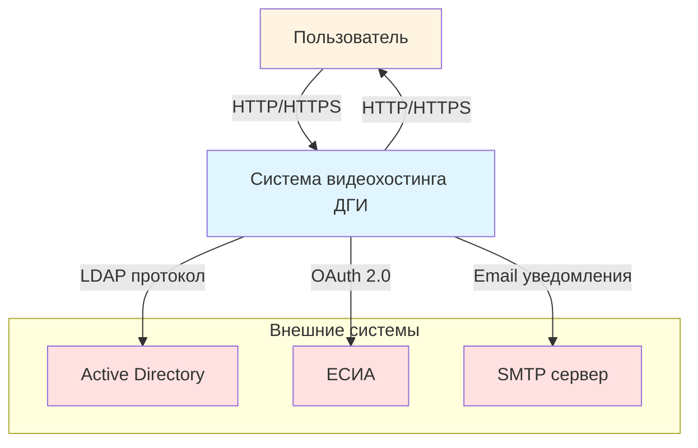

## DFD Уровень 1: Основные процессы системы

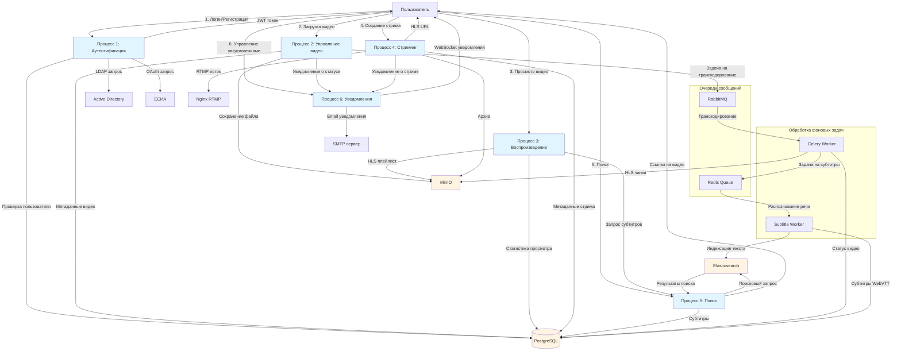

## DFD Уровень 2: Детальный процесс аутентификации

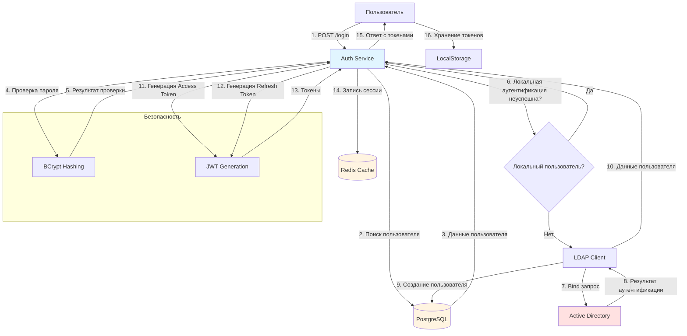

## DFD Уровень 2: Детальный процесс загрузки видео

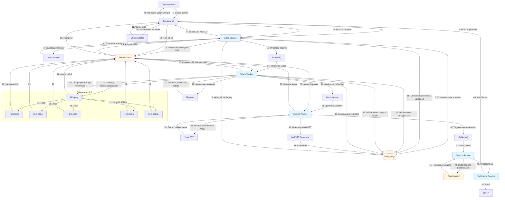

## DFD Уровень 2: Детальный процесс воспроизведения видео

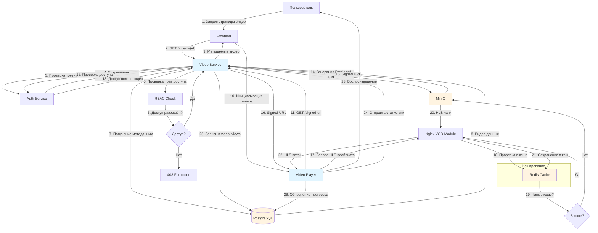

## DFD Уровень 2: Детальный процесс стриминга

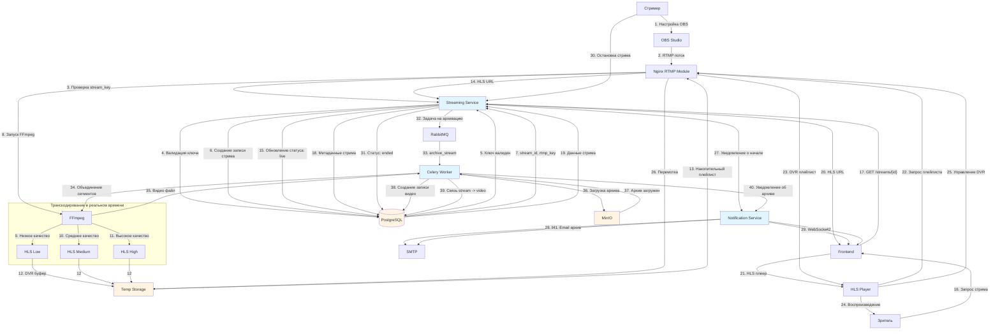

## DFD Уровень 2: Детальный процесс поиска

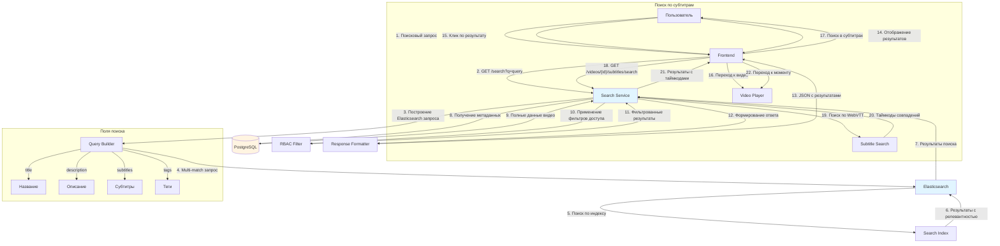

## DFD Уровень 2: Детальный процесс уведомлений

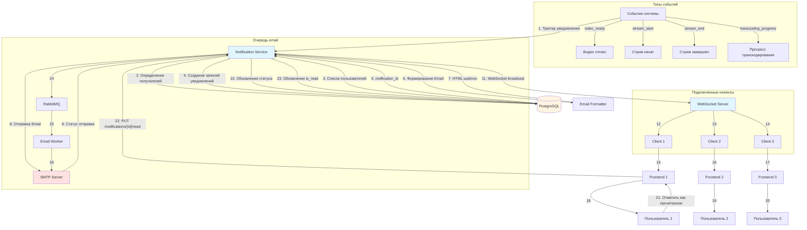

## DFD Уровень 2: Детальный процесс мониторинга

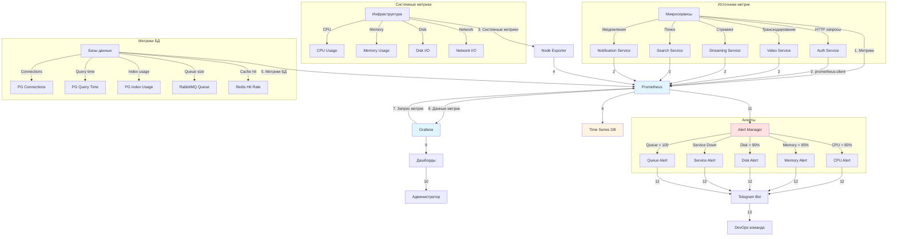

## DFD Уровень 3: Внутренняя логика Video Service

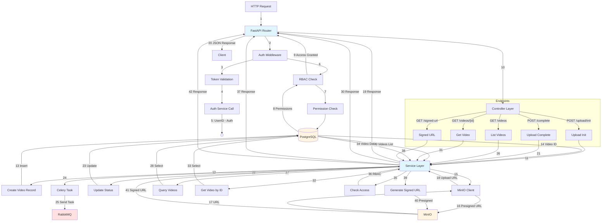

## DFD Уровень 3: Внутренняя логика Celery Worker

```mermaid
graph TD
    RQ[RabbitMQ] -->|1. Получение задачи| CW[Celery Worker]
    
    CW -->|2. Task Router| Router[Task Router]
    
    subgraph Типы задач
        Router -->|transcode_video| Transcode[Transcode Video]
        Router -->|generate_thumbnails| Thumbnails[Generate Thumbnails]
        Router -->|generate_watermark| Watermark[Apply Watermark]
        Router -->|archive_stream| Archive[Archive Stream]
    end
    
    Transcode -->|3. Download Video| MinIO[MinIO]
    MinIO -->|4. Video File| Transcode
    
    Transcode -->|5. FFprobe Analysis| FFprobe[FFprobe]
    FFprobe -->|6. Metadata| Transcode
    
    Transcode -->|7. Update Metadata| D1[(PostgreSQL)]
    D1 -->|8| Transcode
    
    Transcode -->|9. FFmpeg Transcode| FFmpeg[FFmpeg]
    
    subgraph Качества
        FFmpeg -->|180p| Q1[Quality 180p]
        FFmpeg -->|360p| Q2[Quality 360p]
        FFmpeg -->|480p| Q3[Quality 480p]
        FFmpeg -->|720p| Q4[Quality 720p]
        FFmpeg -->|1080p| Q5[Quality 1080p]
    end
    
    Q1 -->|10. Upload HLS| MinIO
    Q2 -->|10| MinIO
    Q3 -->|10| MinIO
    Q4 -->|10| MinIO
    Q5 -->|10| MinIO
    
    Transcode -->|11. Generate Master Playlist| FFmpeg
    FFmpeg -->|12. master.m3u8| MinIO
    
    Transcode -->|13. Update Status: ready| D1
    Transcode -->|14. Update HLS URL| D1
    
    Transcode -->|15. Trigger Subtitle Task| RQ2[Redis Queue]
    
    Thumbnails -->|16. Extract Frames| FFmpeg
    FFmpeg -->|17. Thumbnail Images| MinIO
    Thumbnails -->|18. Update Thumbnails| D1
    
    Watermark -->|19. Apply Watermark Filter| FFmpeg
    FFmpeg -->|20. Watermarked Video| MinIO
    
    Archive -->|21. Download Segments| Temp[Temp Storage]
    Temp -->|22. Segments| Archive
    
    Archive -->|23. Concatenate Segments| FFmpeg
    FFmpeg -->|24. Full Video| Archive
    
    Archive -->|25. Upload Archive| MinIO
    Archive -->|26. Create Video Record| D1
    Archive -->|27. Link Stream to Video| D1
    
    CW -->|28. Task Complete| RQ
    CW -->|29. Update Task Status| Redis[(Redis)]
    
    style CW fill:#e1f5ff
    style D1 fill:#fff4e1
    style MinIO fill:#fff4e1
    style RQ fill:#ffe1e1
    style Redis fill:#fff4e1
```

## DFD Уровень 3: Внутренняя логика Search Service

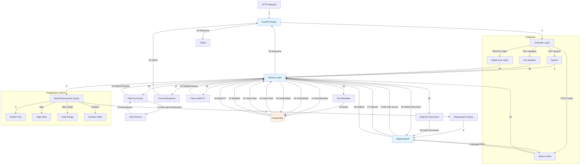
