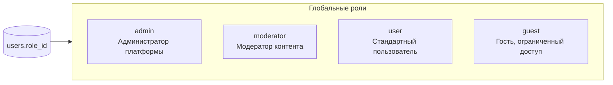
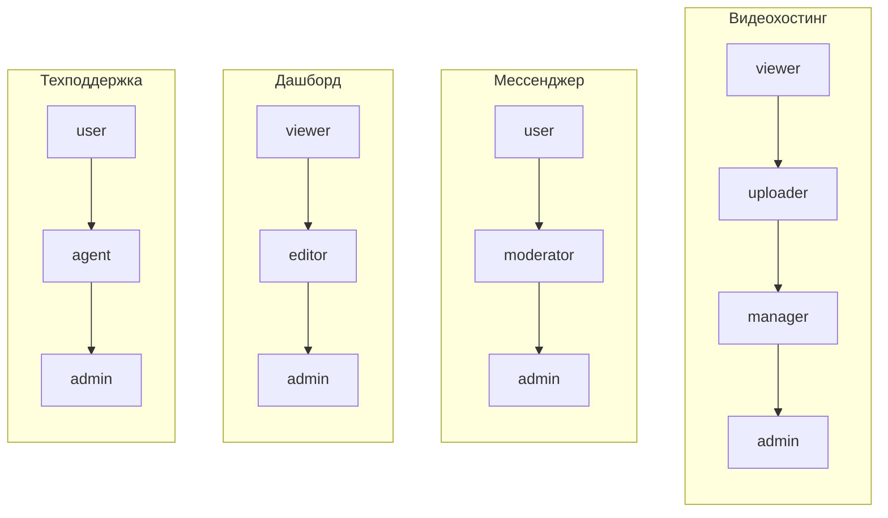
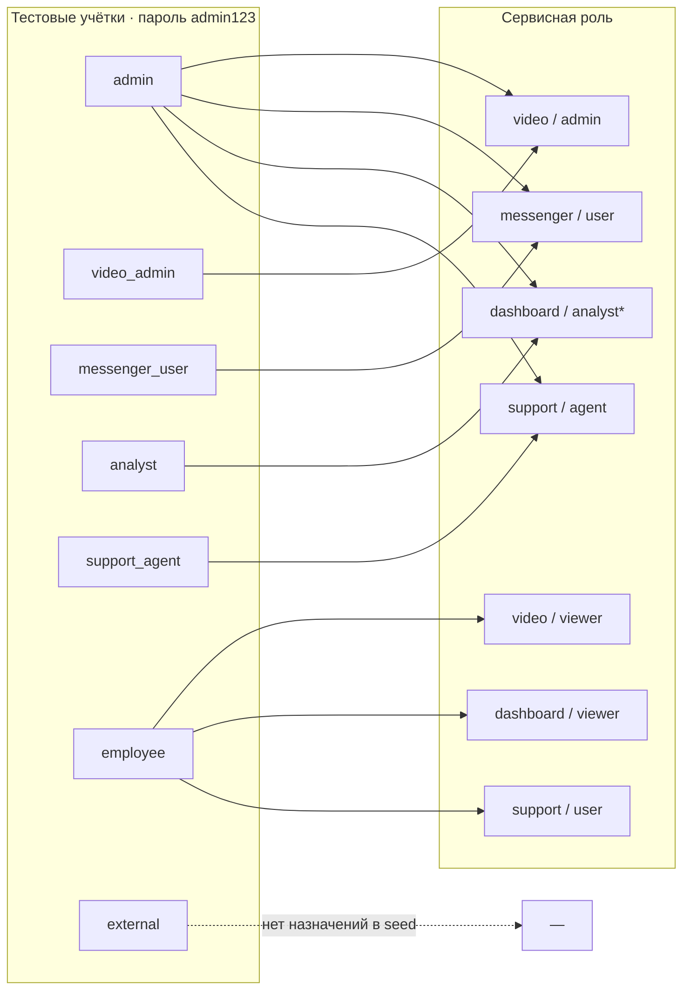
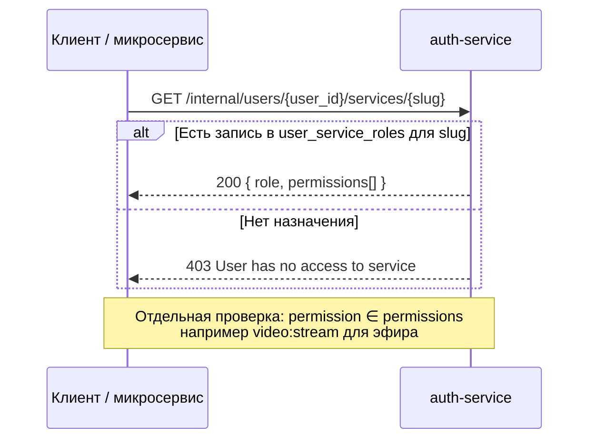
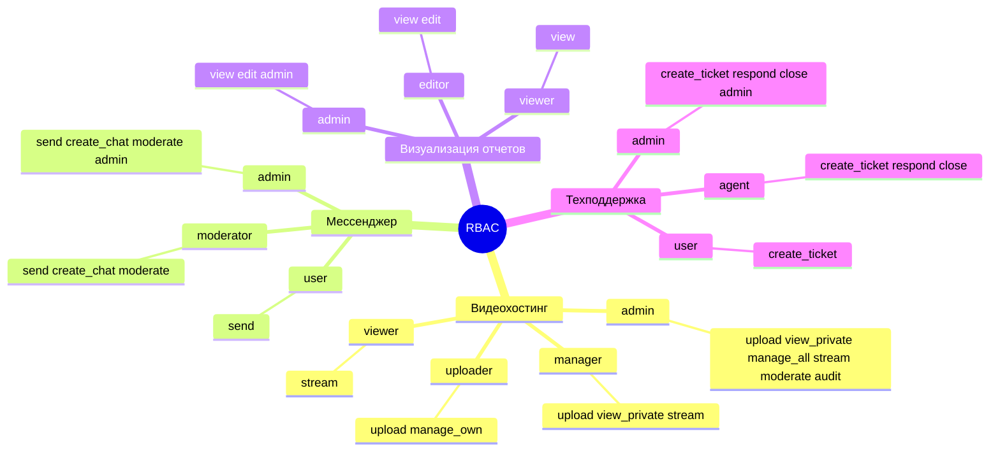

# Роли и права: единая авторизация ДГИ

> **Источник модели:** `services/auth-service/src/main.py` → `initialize_services()`  
> **Схема БД:** `users` → `user_service_roles` → `service_roles` → `service_role_permissions` → `service_permissions` (в разрезе `services.slug`)

---

## 1. Общая архитектура доступа

```mermaid
flowchart TB
  subgraph Auth["auth-service (единый вход)"]
    Login["POST /api/auth/login"]
    JWT["JWT access token"]
    Me["GET /api/auth/me"]
  end

  U[("👤 Пользователь<br/>users")]
  USR["user_service_roles<br/>назначение ролей"]
  SR["service_roles<br/>роль внутри сервиса"]
  SRP["service_role_permissions"]
  SP["service_permissions"]

  U --> USR --> SR --> SRP --> SP
  SR --> SVC["services<br/>video | messenger | dashboard | support"]

  Login --> JWT
  JWT -->|"payload.services"| SVC
  Me --> USR

  subgraph Consumers["/Микросервисы"]
    V["video-service<br/>+ streaming-service"]
    M["messenger-service"]
    D["dashboard-service"]
    P["support-service"]
  end

  JWT --> V & M & D & P
  V & M & D & P -->|"GET/internal/users/{id}/services/{slug}"| Auth
```

**JWT (фрагмент):** для каждого `slug` сервиса, к которому у пользователя есть запись в `user_service_roles`, в токен попадают `role` и список `perms`.

---

## 2. Глобальные роли (legacy, таблица `roles`)

Не заменяют сервисные роли; используются как `users.role_id` (FK, совместимость со старой схемой).

| Глобальная роль | Назначение |
|-----------------|------------|
| `admin` | Учётная запись администратора (не путать с `video/admin`) |
| `moderator` | Глобальный модератор |
| `user` | Обычный пользователь |
| `guest` | Гость |

---

## 3. Сервисные роли и права (каноническая модель)

```mermaid
flowchart TB
  subgraph Video["🎬 Видеохостинг · slug: video"]
    direction TB
    V_A["admin"]
    V_M["manager"]
    V_U["uploader"]
    V_V["viewer"]

  V_A --> V_P1["video:upload"]
  V_A --> V_P2["video:view_private"]
  V_A --> V_P3["video:manage_all"]
  V_A --> V_P4["video:stream"]
  V_A --> V_P5["video:moderate"]
  V_A --> V_P6["video:audit"]

  V_M --> V_P1 & V_P2 & V_P4
  V_U --> V_P1 & V_P7["video:manage_own"]
  V_V --> V_P4
  end

  subgraph Messenger["💬 Мессенджер · slug: messenger"]
    direction TB
    M_A["admin"]
    M_O["moderator"]
    M_U["user"]

    M_A --> M_P1["messenger:send"]
    M_A --> M_P2["messenger:create_chat"]
    M_A --> M_P3["messenger:moderate"]
    M_A --> M_P4["messenger:admin"]

    M_O --> M_P1 & M_P2 & M_P3
    M_U --> M_P1
  end

  subgraph Dashboard["📊 Дашборд · slug: dashboard"]
    direction TB
    D_A["admin"]
    D_E["editor"]
    D_V["viewer"]

    D_A --> D_P1["dashboard:view"]
    D_A --> D_P2["dashboard:edit"]
    D_A --> D_P3["dashboard:admin"]

    D_E --> D_P1 & D_P2
    D_V --> D_P1
  end

  subgraph Support["🎧 Техподдержка · slug: support"]
    direction TB
    S_A["admin"]
    S_G["agent"]
    S_U["user"]

    S_A --> S_P1["support:create_ticket"]
    S_A --> S_P2["support:respond"]
    S_A --> S_P3["support:close"]
    S_A --> S_P4["support:admin"]

    S_G --> S_P1 & S_P2 & S_P3
    S_U --> S_P1
  end
```

---

## 4. Матрица «роль → разрешения» (все сервисы)

### 4.1 Видеохостинг (`video`)

| Сервисная роль | `video:upload` | `video:view_private` | `video:manage_own` | `video:manage_all` | `video:stream` | `video:moderate` | `video:audit` |
|----------------|:--------------:|:--------------------:|:------------------:|:------------------:|:--------------:|:----------------:|:-------------:|
| **admin**      | ✅ | ✅ | — | ✅ | ✅ | ✅ | ✅ |
| **manager**    | ✅ | ✅ | — | — | ✅ | — | — |
| **uploader**   | ✅ | — | ✅ | — | — | — | — |
| **viewer**     | — | — | — | — | ✅ | — | — |

*Проверка в коде:* `video:stream` — `streaming-service`; остальные права — `video-service` (через `auth_client.check_permission`).

### 4.2 Мессенджер (`messenger`)

| Сервисная роль | `messenger:send` | `messenger:create_chat` | `messenger:moderate` | `messenger:admin` |
|----------------|:----------------:|:-----------------------:|:--------------------:|:-----------------:|
| **admin**      | ✅ | ✅ | ✅ | ✅ |
| **moderator**  | ✅ | ✅ | ✅ | — |
| **user**       | ✅ | — | — | — |

### 4.3 Дашборд (`dashboard`)

| Сервисная роль | `dashboard:view` | `dashboard:edit` | `dashboard:admin` |
|----------------|:----------------:|:------------------:|:-----------------:|
| **admin**      | ✅ | ✅ | ✅ |
| **editor**     | ✅ | ✅ | — |
| **viewer**     | ✅ | — | — |

### 4.4 Техподдержка (`support`)

| Сервисная роль | `support:create_ticket` | `support:respond` | `support:close` | `support:admin` |
|----------------|:-----------------------:|:-----------------:|:---------------:|:---------------:|
| **admin**      | ✅ | ✅ | ✅ | ✅ |
| **agent**      | ✅ | ✅ | ✅ | — |
| **user**       | ✅ | — | — | — |

---

## 5. Иерархия ролей внутри каждого сервиса

*Стрелка «ниже → выше» = больше прав в рамках сервиса.*

---

## 6. Тестовые пользователи и кросс-сервисные роли

Назначения из `database/seed_data.sql` (после загрузки сида).

| Пользователь | Видеохостинг | Мессенджер | Дашборд | Техподдержка | `is_employee` |
|--------------|--------------|------------|---------|--------------|:-------------:|
| `admin` | admin | user | analyst* | agent | ✅ |
| `video_admin` | admin | — | — | — | ✅ |
| `messenger_user` | — | user | — | — | ✅ |
| `analyst` | — | — | analyst* | — | ✅ |
| `support_agent` | — | — | — | agent | ✅ |
| `employee` | viewer | — | viewer | user | ✅ |
| `external` | — | — | — | — | ❌ |

\* В сиде роль `dashboard/analyst`; при старте auth-service создаётся роль **`editor`** (не `analyst`). После `initialize_services` для дашборда используйте `editor` или добавьте `analyst` в код сида.

---

## 7. Доступ к сервису vs наличие права

| Уровень | Что означает |
|---------|----------------|
| **Доступ к сервису** | Есть хотя бы одна строка в `user_service_roles` для `services.slug` |
| **Конкретное действие** | В JWT / internal API есть строка разрешения, например `video:upload` |

---

## 8. Сводная карта: 4 сервиса × роли (один взгляд)

---

*Файл предназначен для просмотра в GitHub/GitLab (Mermaid). При расхождении с БД после старого сида перезапустите auth-service или выполните миграции — эталон ролей и прав задаётся в `initialize_services`.*
